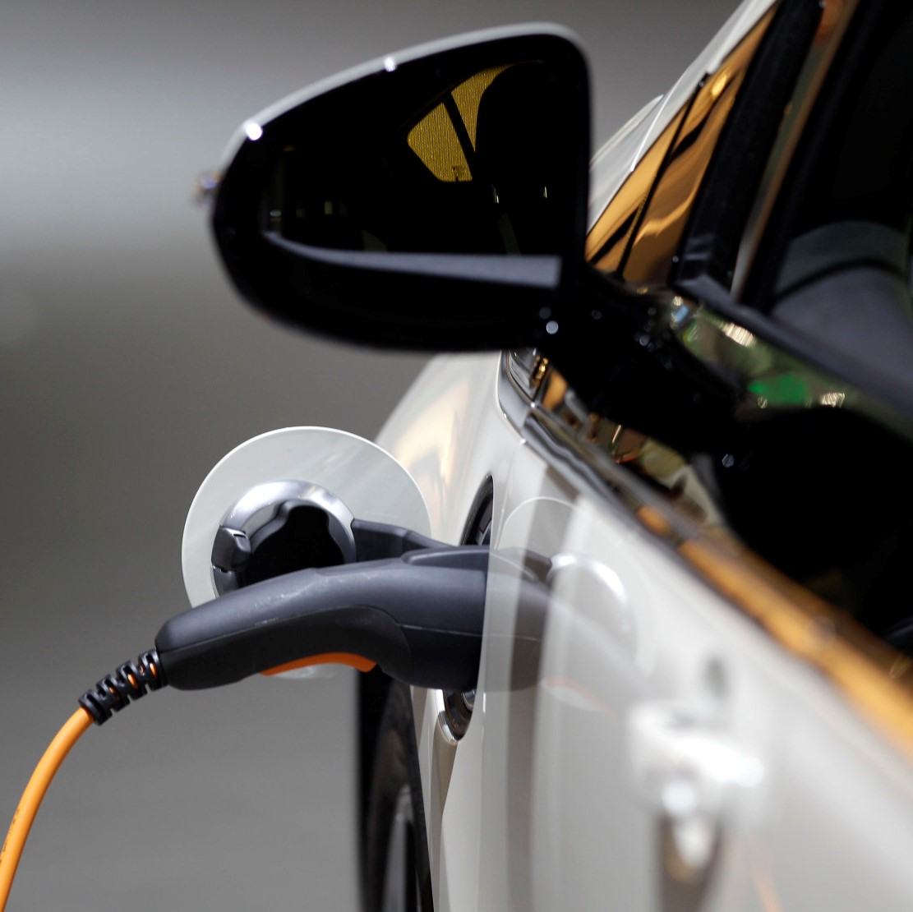
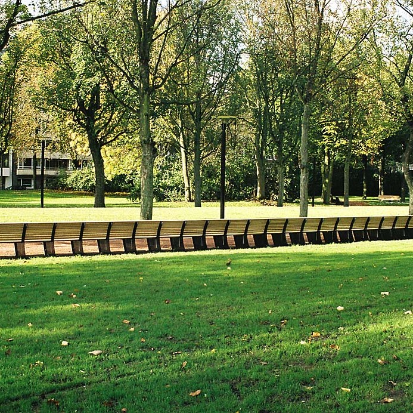

    

        <iframe src="https://www.google.com/maps/embed?pb=!1m18!1m12!1m3!1d160409.85245155697!2d3.574402557872501!3d51.08255230068741!2m3!1f0!2f0!3f0!3m2!1i1024!2i768!4f13.1!3m3!1m2!1s0x47c370e1339443ad%3A0x40099ab2f4d5140!2sGhent!5e0!3m2!1sen!2sbe!4v1480194012132" width="100%" height="270"     frameborder="0"     style="border:0" allowfullscreen></iframe>
    

    

        

            <button class="col-xs-12 nearby-button">Search Nearby</button>
            <a href="more-info.html">
                

                    

                        
                    

                    

                        <h4 class="bitter main-title">Electric charger</h4>
                        Charge your car 
                        and recieve 7 bees
                    

                

            </a>
            <a href="more-info.html">
                

                    

                        
                    

                    

                        <h4 class="bitter main-title">Bird Counting</h4>
                        Watch some birds 
                        and recieve 5 bees
                    

                

            </a>
            <a href="more-info.html">
                

                    

                        
                    

                    

                        <h4 class="bitter main-title">Muinkpark</h4>
                        Walk in the park 
                        and recieve 3 bees
                    

                

            </a>
            <a href="more-info.html">
                

                    

                        
                    

                    

                        <h4 class="bitter friend-name">Tree Watching</h4>
                        Check out some trees 
                        and recieve 4 bees
                    

                

            </a>
        

    

