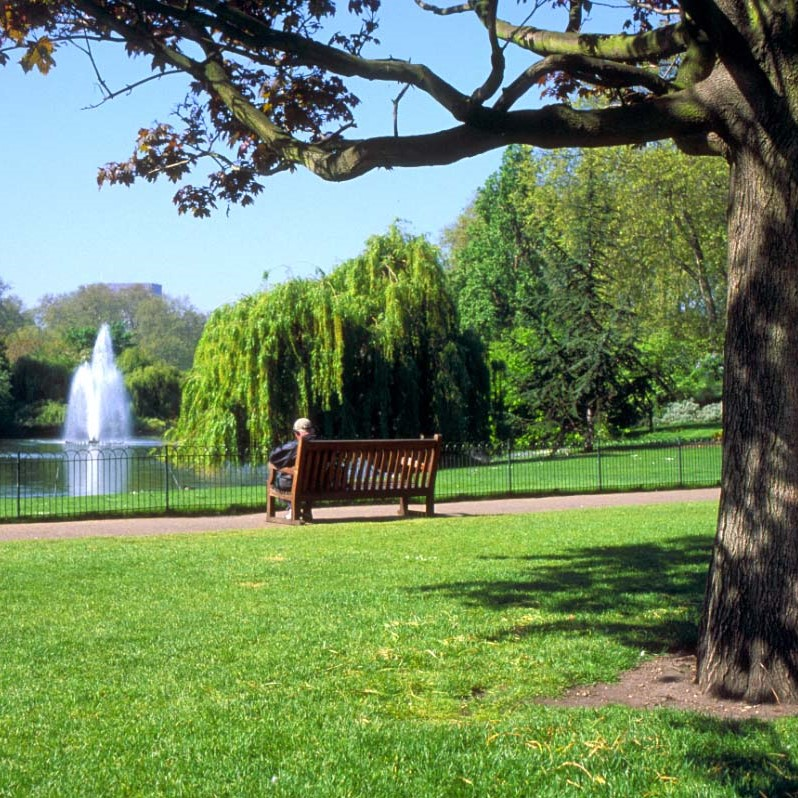
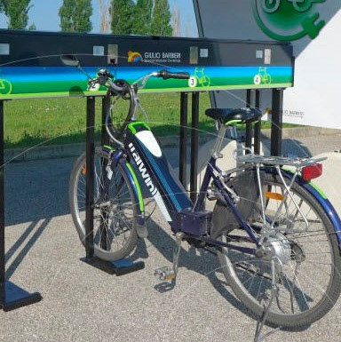
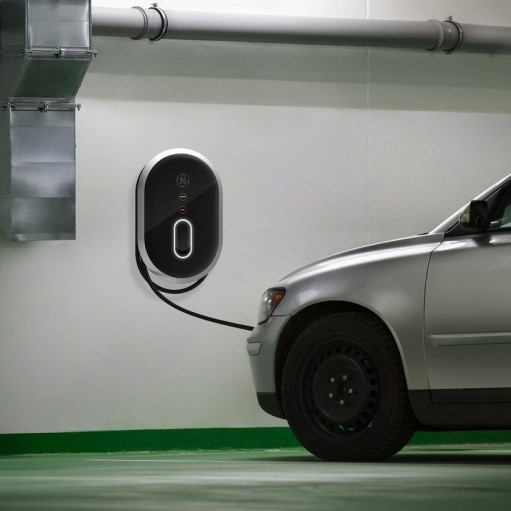
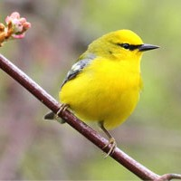

<!-- Tree decoration -->

<!-- END Tree decoration -->

<!-- Profile card and progress bar -->

    

        <h2>Adriaan Glibert</h2>
        
Bees earned: 

        
Trees planted: 

        
Ranking: 

    

    

    

<!-- MAIN -->

<a href="more-info.html">

    

        
    

    

        <h4 class="bitter main-title">Super!</h4>
        Walked in Zuidpark 
        Recieved 4 bees
    

</a>

<a href="more-info.html">

    

        
    

    

        <h4 class="bitter main-title">Good job!</h4>
        Charged bike 
        Recieved 7 bees
    

</a>

<a href="more-info.html">

    

        
    

    

        <h4 class="bitter main-title">Keep going!</h4>
        Charged Tesla 
        Recieved 7 bees
    

</a>

<a href="more-info.html">

    

        
    

    

        <h4 class="bitter main-title">We're proud!</h4>
        Went bird watching 
        Recieved 4 bees
    

</a>

  